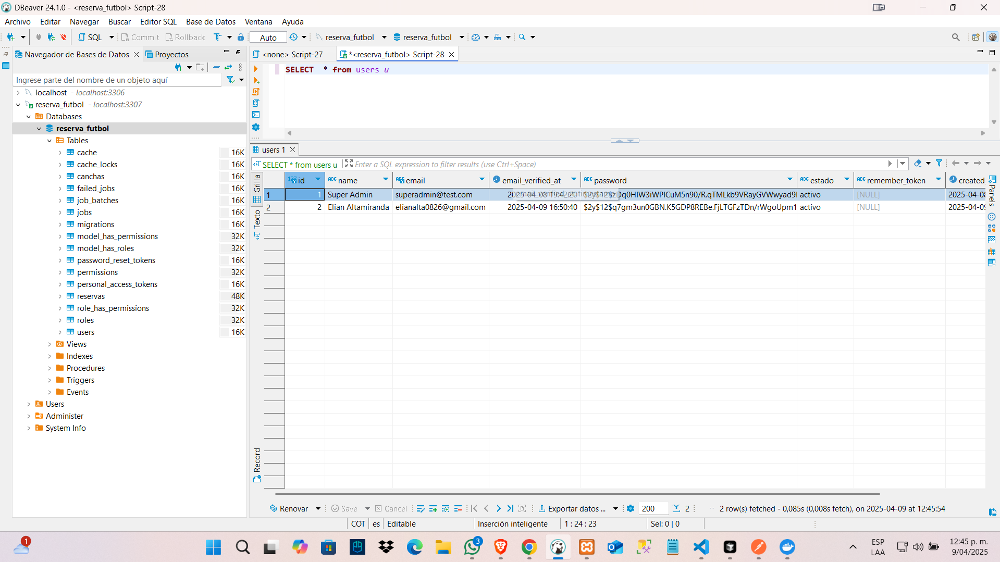
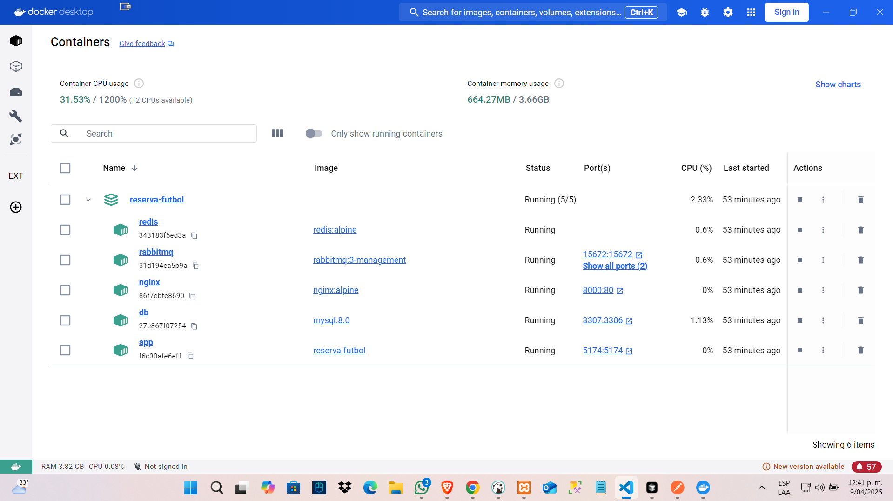
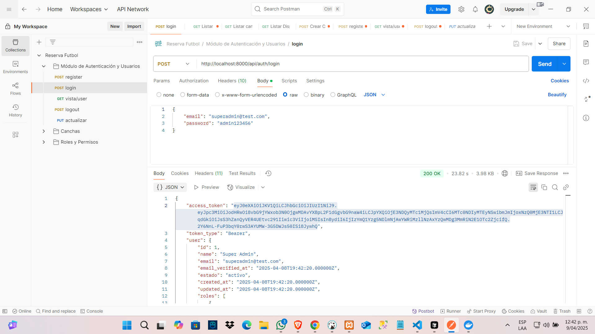
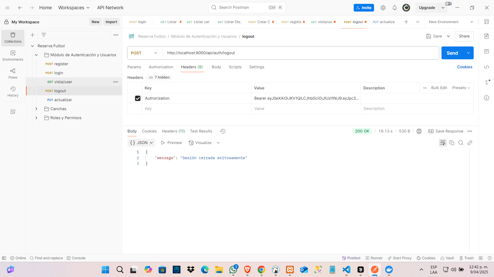
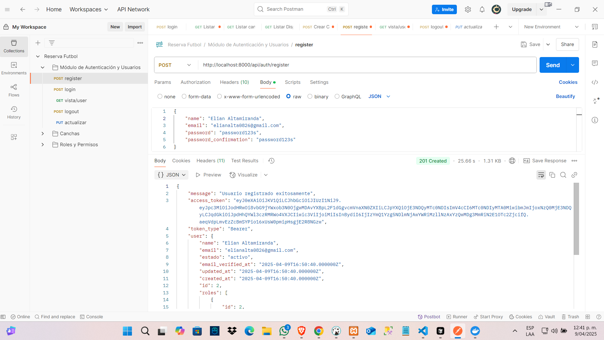
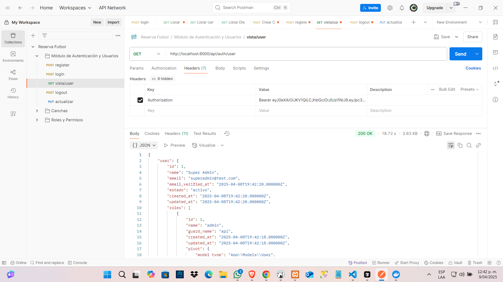

# Reserva-fut

Reserva-fut es un sistema para gestionar reservas de canchas de fútbol. Este proyecto está diseñado para facilitar la administración de horarios, usuarios y pagos relacionados con las reservas.

## Sistema de Reserva de Canchas de Fútbol - Microservicios

Este proyecto implementa un sistema de reserva de canchas de fútbol utilizando una arquitectura de microservicios con Laravel, Docker y MySQL. 

## Requisitos Funcionales Implementados

✅ **1. Arquitectura de Microservicios:**
- Implementación del sistema en microservicios usando Laravel
- **Enfoque modular**: Cada módulo funciona como un servicio independiente que se comunica a través de APIs REST
- Estructura basada en módulos separados en lugar de un monolito, permitiendo desacoplamiento y mantenibilidad
- Microservicios principales implementados:
  - Módulo de Autenticación y Usuarios
  - Módulo de Roles y Permisos
  - Módulo de Canchas (parcial)

✅ **2. Módulo de Autenticación y Usuarios (Microservicio 1):**
- Registro y login de usuarios
- Implementación de recuperación de contraseña
- Roles implementados:
  - Administrador: Con acceso total al sistema
  - Usuario: Con acceso limitado a sus propias reservas
- Autenticación basada en tokens JWT
- Funcionalidades para que los usuarios puedan registrarse, iniciar sesión y actualizar su perfil

✅ **3. Módulo de Roles y Permisos (Microservicio 2):**
- Integración del paquete spatie/laravel-permission
- CRUD de roles y permisos (exclusivo para administradores)
- Sistema de asignación y gestión de permisos a los usuarios

## Estructura del Proyecto

La clave del proyecto es su organización en módulos independientes dentro de Laravel, evitando el enfoque monolítico tradicional. Cada módulo encapsula sus propias entidades, controladores, rutas y lógica de negocio:


```
app/
├── Modules/                  # Directorio principal de módulos
│   ├── Auth/                 # Módulo de Autenticación y Usuarios
│   │   ├── Controllers/      # Controladores de autenticación
│   │   ├── Models/           # Modelos relacionados con usuarios
│   │   ├── Providers/        # Proveedores de servicios
│   │   ├── Routes/           # Rutas específicas de autenticación
│   │   └── Requests/         # Validaciones de formularios
│   │
│   ├── Canchas/              # Módulo de Gestión de Canchas
│   │   ├── Controllers/      # Controladores de canchas
│   │   ├── Models/           # Modelos de canchas
│   │   ├── Policies/         # Políticas de autorización
│   │   ├── Providers/        # Proveedores de servicios
│   │   ├── Routes/           # Rutas específicas de canchas
│   │   └── Requests/         # Validaciones de formularios
│   │
│   ├── Dashboard/            # Módulo de Dashboard Administrativo
│   │
│   ├── Reservas/             # Módulo de Gestión de Reservas
│   │
│   └── RolesPermisos/        # Módulo de Roles y Permisos
│
├── Http/                     # Componentes globales HTTP
├── Models/                   # Modelos compartidos
├── Policies/                 # Políticas globales
└── Providers/                # Proveedores globales
```

Esta arquitectura modular proporciona diversas ventajas:

- **Autonomía**: Cada módulo puede desarrollarse y mantenerse de forma independiente
- **Desacoplamiento**: Los cambios en un módulo no afectan a otros
- **Escalabilidad**: Facilita el crecimiento y la evolución del sistema
- **Mantenibilidad**: Código más organizado y fácil de mantener
- **Testabilidad**: Permite probar cada módulo de forma aislada

## Tecnologías Utilizadas

- **Backend**: Laravel 10
- **Base de Datos**: MySQL
- **Autenticación**: JWT (JSON Web Tokens)
- **Gestión de Permisos**: Spatie Laravel Permission
- **Contenedores**: Docker y Docker Compose
- **Mensajería**: RabbitMQ
- **API Gateway**: Nginx como proxy inverso
- **Cache y Colas**: Redis

## Entorno Dockerizado

El proyecto ha sido configurado con Docker para facilitar su despliegue y desarrollo. Los contenedores implementados incluyen:

- **app**: Aplicación Laravel
- **db**: Servidor MySQL
- **nginx**: Servidor web y proxy inverso
- **redis**: Caché y colas
- **rabbitmq**: Mensajería entre microservicios

image.png

## Estructura de la Base de Datos

La base de datos incluye las siguientes tablas principales:

- users
- roles
- permissions
- model_has_roles
- model_has_permissions
- canchas
- reservas

image.png

## Módulos Implementados

### 1. Módulo de Autenticación y Usuarios

Este módulo gestiona todo lo relacionado con la autenticación y gestión de usuarios:

- **Registro de usuarios**
- **Inicio de sesión**
- **Recuperación de contraseña**
- **Actualización de perfil**
- **Verificación de correo electrónico**

**Ejemplo de respuesta en registro exitoso:**


```json
{
    "message": "Usuario registrado exitosamente",
    "access_token": "eyJ0eXAiOiJKV1QiLCJhbGciOiJIUzI1NiJ9...",
    "token_type": "Bearer",
    "user": {
        "name": "Elian Altamiranda",
        "email": "elianalta0826@gmail.com",
        "estado": "activo",
        "email_verified_at": "2025-04-09T16:50:40.000000Z",
        "updated_at": "2025-04-09T16:50:40.000000Z",
        "created_at": "2025-04-09T16:50:40.000000Z",
        "id": 2,
        "roles": [
            {
                "id": 2,
                "name": "usuario",
                "guard_name": "api",
                "created_at": "2025-04-08T19:42:18.000000Z",
                "updated_at": "2025-04-08T19:42:18.000000Z",
                "pivot": {
                    "model_type": "App\\Models\\User",
                    "model_id": 2,
                    "role_id": 2
                }
            }
        ]
    }
}
```

**Endpoints principales:**
- `POST /api/auth/register` - Registro de usuario
- `POST /api/auth/login` - Inicio de sesión
- `POST /api/auth/logout` - Cierre de sesión
- `GET /api/auth/user` - Información del usuario actual
- `POST /api/auth/password/reset` - Recuperación de contraseña

### 2. Módulo de Roles y Permisos

Este módulo implementa la gestión de roles y permisos utilizando el paquete Spatie Laravel Permission:

- **CRUD de roles** (admin)
- **CRUD de permisos** (admin)
- **Asignación de roles a usuarios**
- **Gestión de permisos por rol**

El sistema incluye dos roles principales:
- **Admin**: Con acceso total al sistema
- **Usuario**: Con acceso limitado a sus propias reservas

**Ejemplo de permisos del administrador:**


```json
{
    "permissions": [
        "ver-canchas",
        "ver-cancha",
        "crear-cancha",
        "editar-cancha",
        "eliminar-cancha",
        "ver-disponibilidad",
        "ver-mis-reservas",
        "ver-todas-reservas",
        "crear-reserva",
        "ver-reserva",
        "editar-reserva",
        "cancelar-reserva"
    ]
}
```

**Endpoints principales:**
- `GET /api/roles` - Listar roles
- `POST /api/roles` - Crear rol (admin)
- `GET /api/permissions` - Listar permisos
- `POST /api/roles/{role}/permissions` - Asignar permisos a rol

### 3. Módulo de Canchas (Parcialmente implementado)

Este módulo gestiona la estructura básica para las canchas de fútbol:

- **Estructura de modelo para canchas**
- **Endpoints básicos configurados**
- **Validaciones preparadas**

**Endpoints configurados:**
- `GET /api/canchas` - Listar todas las canchas
- `GET /api/canchas/disponibles` - Listar canchas disponibles
- `GET /api/canchas/{id}` - Ver detalles de una cancha
- `GET /api/canchas/{id}/disponibilidad` - Verificar disponibilidad
- `POST /api/canchas` - Crear cancha (admin)
- `PUT /api/canchas/{id}` - Actualizar cancha (admin)
- `DELETE /api/canchas/{id}` - Eliminar cancha (admin)

## Funcionalidades avanzadas del módulo de Canchas

- Gestión de horarios y disponibilidad.
- Confirmación y cancelación de reservas.
- Visualización de estadísticas de uso.
- Integración con métodos de pago.

## Ejemplo de Respuestas de la API

### Inicio de sesión (admin):


```json
{
    "access_token": "eyJ0eXAiOiJKV1QiLCJhbGciOiJIUzI1NiJ9...",
    "token_type": "Bearer",
    "user": {
        "id": 1,
        "name": "Super Admin",
        "email": "superadmin@test.com",
        "email_verified_at": "2025-04-08T19:42:20.000000Z",
        "estado": "activo",
        "created_at": "2025-04-08T19:42:20.000000Z",
        "updated_at": "2025-04-08T19:42:20.000000Z",
        "roles": [
            {
                "id": 1,
                "name": "admin",
                "guard_name": "api",
                "created_at": "2025-04-08T19:42:18.000000Z",
                "updated_at": "2025-04-08T19:42:18.000000Z",
                "pivot": {
                    "model_type": "App\\Models\\User",
                    "model_id": 1,
                    "role_id": 1
                }
            }
        ],
        "permissions": [/* lista de permisos */]
    },
    "roles": ["admin"],
    "permissions": [
        "ver-canchas",
        "ver-cancha",
        "crear-cancha",
        "editar-cancha",
        "eliminar-cancha",
        "ver-disponibilidad",
        "ver-mis-reservas",
        "ver-todas-reservas",
        "crear-reserva",
        "ver-reserva",
        "editar-reserva",
        "cancelar-reserva"
    ]
}
```

### Cierre de sesión:


```json
{
    "message": "Sesión cerrada exitosamente"
}
```

## Instalación y Configuración

### Requisitos previos
- Docker y Docker Compose
- Git

### Pasos de instalación

1. Clonar el repositorio:
```bash
git clone https://github.com/usuario/reserva-futbol.git
cd reserva-futbol
```

2. Configurar variables de entorno:
```bash
cp .env.example .env
```

3. Iniciar los contenedores:
```bash
docker-compose up -d
```

4. Instalar dependencias:
```bash
docker-compose exec app composer install
```

5. Generar clave de aplicación:
```bash
docker-compose exec app php artisan key:generate
```

6. Ejecutar migraciones:
```bash
docker-compose exec app php artisan migrate --seed
```

7. Generar clave JWT:
```bash
docker-compose exec app php artisan jwt:secret
```

## Credenciales por defecto

**Administrador:**
- Email: superadmin@test.com
- Password: admin123456

**Usuario normal (después de registrarse):**
- El rol asignado será "usuario"

## Estado Actual del Proyecto

Se han implementado completamente los siguientes componentes:

✅ Arquitectura base de microservicios con módulos independientes
✅ Módulo de Autenticación y Usuarios con JWT
✅ Módulo de Roles y Permisos con Spatie
✅ Estructura básica para el módulo de Canchas
✅ Entorno Docker con todos los servicios necesarios

Los siguientes componentes están pendientes de implementación completa:
- Módulo de Reservas (implementación completa)
- Dashboard administrativo (implementación completa)
- Funcionalidades avanzadas del módulo de Canchas

## Capturas de Pantalla

### 1. Base de Datos


### 2. Docker


### 3. Login


### 4. Logout


### 5. Registrar


### 6. Ver Reservas

